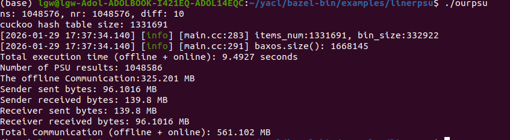

# OurPSU


## Prequisites

- **bazel**: [.bazelversion](.bazelversion) file describes the recommended version of bazel. We recommend to use the official [bazelisk](https://github.com/bazelbuild/bazelisk?tab=readme-ov-file#installation) to manage bazel version.
- **gcc >= 10.3**
- **[cmake](https://cmake.org/getting-started/)**
- **[ninja/ninja-build](https://ninja-build.org/)**
- **[secure-join](https://github.com/ladnir/secure-join)**
- **Perl 5 with core modules** (Required by [OpenSSL](https://github.com/openssl/openssl/blob/master/INSTALL.md#prerequisites))

## Build
```
git clone https://github.com/secretflow/yacl.git
cd yacl/examples/
git clone this repository
cd ..
bazel build --linkopt=-ldl //...
cd bazel-bin/examples/linerpsu
./ourpsu
```

## The Update Results Example (Very Fast)

