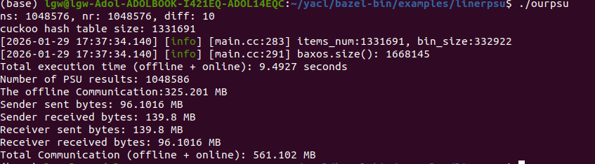

# LinearPSU

This repository contains the `examples/linerpsu` implementation used in the
YACL workspace.  It is intended to be built as
`//examples/linerpsu:ourpsu` inside a full YACL checkout, because the code uses
YACL headers/libraries, Bazel macros, and several locally built libOTe-family
dependencies.

## What Is Built

- `//examples/linerpsu:ourpsu`: the full PSU benchmark binary.
- `//examples/linerpsu:opprf_mask_bench`: the OPPRF mask-generation benchmark.
- `LINERPSU_OKVS_BACKEND=okvs`: use the default Baxos/OKVS path.
- `LINERPSU_OKVS_BACKEND=bandokvs`: use the BPSY23-style RB/BandOKVS path.

The current full PSU path uses the stationary GMW triple generator and is
compiled with AVX2/AVX-512 options.  Run it on an x86-64 machine with AVX-512F
and AVX-512DQ support when using the default Docker build.

## Docker Usage

The recommended portable path is Docker.  The image contains a pinned YACL
workspace, the required `secure-join` and stationary libOTe builds, this
`examples/linerpsu` tree, and the built `//examples/linerpsu:ourpsu` binary.
The default command runs `/workspace/yacl/bazel-bin/examples/linerpsu/ourpsu`.

### Use a Published Image

Pull the published image from Docker Hub:

```bash
docker pull shallmate/linearpsu
```

Run a small PSU smoke test with the default OKVS backend:

```bash
docker run --rm \
  -e OMP_NUM_THREADS=1 \
  -e PSU_PEQT_GMW_THREADS=1 \
  -e PSU_PEQT_PARALLEL_BATCHES=1 \
  -e LINERPSU_RESULT_LINE=1 \
  -e LINERPSU_LOGN=8 \
  shallmate/linearpsu
```

Run the same test with the BPSY23 BandOKVS backend:

```bash
docker run --rm \
  -e OMP_NUM_THREADS=1 \
  -e PSU_PEQT_GMW_THREADS=1 \
  -e PSU_PEQT_PARALLEL_BATCHES=1 \
  -e LINERPSU_RESULT_LINE=1 \
  -e LINERPSU_LOGN=8 \
  -e LINERPSU_OKVS_BACKEND=bandokvs \
  shallmate/linearpsu
```

### Build Locally

From the YACL checkout root, build the image using this repository as the build
context:

```bash
DOCKER_BUILDKIT=1 docker build \
  -f examples/linerpsu/Dockerfile \
  -t linerpsu \
  examples/linerpsu
```

If you are already inside the `examples/linerpsu` repository, the equivalent
command is:

```bash
DOCKER_BUILDKIT=1 docker build -t linerpsu .
```

The dependency prefix inside the image defaults to `/opt/linerpsu-deps`.  To use
a different image-internal prefix, pass
`--build-arg LINERPSU_DEPS=/some/writable/path`.

Run the locally built image:

```bash
docker run --rm \
  -e OMP_NUM_THREADS=1 \
  -e PSU_PEQT_GMW_THREADS=1 \
  -e PSU_PEQT_PARALLEL_BATCHES=1 \
  -e LINERPSU_RESULT_LINE=1 \
  -e LINERPSU_LOGN=8 \
  linerpsu
```

## Required Dependencies

The native build has the following real dependencies:

- Ubuntu 22.04 or a similar Linux distribution.
- GCC/G++ with C++20 support.
- Bazel 6.5.0.
- CMake and Ninja.
- OpenSSL, GMP, NTL, libsodium headers, Boost, pthread, and OpenMP runtime
  libraries.
- `secure-join` built locally from
  `https://github.com/ladnir/secure-join.git`.
- A stationary-capable `libOTe` checkout built locally from
  `https://github.com/osu-crypto/libOTe.git`.
- A second PIC build of the stationary libOTe stack used to link
  `GMW/SilentTripleGen.cpp` into
  `libsilent_triple_gen_stationary_linerpsu.so`.

For a native build, choose dependency roots on your own machine and point the
YACL `WORKSPACE` entries at those roots.  The Docker build below does this
rewrite inside the image automatically.

## Native Build

The native build expects this repository to live under `examples/linerpsu` of a
YACL checkout:

```bash
git clone https://github.com/ShallMate/yacl.git
cd yacl/examples
git clone https://github.com/ShallMate/linerpsu.git linerpsu
cd ..
```

Choose local dependency roots.  The defaults below stay under the YACL checkout,
but any writable paths are fine:

```bash
export LINERPSU_DEPS="${LINERPSU_DEPS:-$PWD/.linerpsu-deps}"
export SECURE_JOIN_ROOT="${SECURE_JOIN_ROOT:-$LINERPSU_DEPS/secure-join}"
export LIBOTE_ROOT="${LIBOTE_ROOT:-$LINERPSU_DEPS/libOTe}"
export LIBOTE_PIC_ROOT="${LIBOTE_PIC_ROOT:-$LINERPSU_DEPS/libOTe-pic}"
```

Install system packages:

```bash
sudo apt-get update
sudo apt-get install -y \
  build-essential ca-certificates cmake curl git ninja-build pkg-config \
  python3 unzip wget zip perl nasm autoconf automake libtool \
  libboost-all-dev libssl-dev libgmp-dev libntl-dev libsodium-dev \
  libgflags-dev libgoogle-glog-dev libunwind-dev openjdk-17-jdk-headless
```

Install Bazel 6.5.0:

```bash
curl -fsSL -o /usr/local/bin/bazel \
  https://github.com/bazelbuild/bazel/releases/download/6.5.0/bazel-6.5.0-linux-x86_64
chmod +x /usr/local/bin/bazel
```

Build `secure-join`:

```bash
git clone https://github.com/ladnir/secure-join.git "$SECURE_JOIN_ROOT"
cd "$SECURE_JOIN_ROOT"
git checkout 377ca63b9d8f4f6aede0d3a2e3d9078973a3ee10
cmake -S . -B out/build/linux \
  -DCMAKE_BUILD_TYPE=Release \
  -DFETCH_AUTO=ON \
  -DSUDO_FETCH=OFF \
  -DENABLE_CIRCUITS=ON \
  -DENABLE_MRR=ON \
  -DENABLE_IKNP=ON \
  -DENABLE_SOFTSPOKEN_OT=ON \
  -DENABLE_SILENTOT=ON \
  -DENABLE_SILENT_VOLE=ON \
  -DENABLE_BITPOLYMUL=ON \
  -DSODIUM_MONTGOMERY=OFF \
  -DSECUREJOIN_ENABLE_BOOST=OFF
cmake --build out/build/linux --parallel "$(nproc)"
```

Build the stationary libOTe checkout:

```bash
git clone https://github.com/osu-crypto/libOTe.git "$LIBOTE_ROOT"
cd "$LIBOTE_ROOT"
git checkout a403ec37c6a32148648b7d8fd66dc35318d9f99d
git submodule update --init --recursive
cmake -S . -B out/build/linux \
  -DCMAKE_BUILD_TYPE=Release \
  -DCMAKE_INSTALL_PREFIX=/usr/local \
  -DFETCH_AUTO=ON \
  -DFETCH_SODIUM=ON \
  -DFETCH_RELIC=ON \
  -DFETCH_BITPOLYMUL=ON \
  -DENABLE_BITPOLYMUL=ON \
  -DENABLE_RELIC=ON \
  -DENABLE_MRR=ON \
  -DENABLE_MRR_TWIST=ON \
  -DENABLE_SIMPLESTOT=ON \
  -DENABLE_SIMPLESTOT_ASM=ON \
  -DENABLE_MR_KYBER=ON \
  -DENABLE_IKNP=ON \
  -DENABLE_SOFTSPOKEN_OT=ON \
  -DENABLE_SILENTOT=ON \
  -DENABLE_SILENT_VOLE=ON \
  -DENABLE_BOOST=ON \
  -DENABLE_SODIUM=ON \
  -DLIBOTE_STD_VER=20
cmake --build out/build/linux --parallel "$(nproc)"
sudo cmake --install out/build/linux
```

Build the PIC stationary libOTe tree expected by the GMW wrapper:

```bash
install -d "$LIBOTE_PIC_ROOT/deps"
cmake -S "$LIBOTE_ROOT" -B "$LIBOTE_PIC_ROOT/rebuild" \
  -DCMAKE_BUILD_TYPE=Release \
  -DENABLE_PIC=ON \
  -DCMAKE_POSITION_INDEPENDENT_CODE=ON \
  -DCMAKE_INSTALL_PREFIX="$LIBOTE_PIC_ROOT/install" \
  -DOC_THIRDPARTY_HINT="$LIBOTE_PIC_ROOT/install" \
  -DOC_THIRDPARTY_INSTALL_PREFIX="$LIBOTE_PIC_ROOT/install" \
  -DOC_THIRDPARTY_CLONE_DIR="$LIBOTE_PIC_ROOT/deps" \
  -DFETCH_AUTO=ON \
  -DFETCH_SODIUM=ON \
  -DENABLE_MRR=ON \
  -DENABLE_MRR_TWIST=ON \
  -DENABLE_SIMPLESTOT=ON \
  -DENABLE_IKNP=ON \
  -DENABLE_SOFTSPOKEN_OT=ON \
  -DENABLE_SILENTOT=ON \
  -DENABLE_SILENT_VOLE=ON \
  -DENABLE_BOOST=ON \
  -DENABLE_SODIUM=ON \
  -DLIBOTE_STD_VER=20
cmake --build "$LIBOTE_PIC_ROOT/rebuild" --parallel "$(nproc)"
cmake --install "$LIBOTE_PIC_ROOT/rebuild"
```

From the YACL root, patch `WORKSPACE` to use the roots you chose.  The helper
updates existing local repositories when they are present and appends them when
the checked-out YACL workspace does not already define them:

```bash
python3 examples/linerpsu/tools/patch_workspace.py
```

Then build the PSU binary from the YACL root:

```bash
cd /path/to/yacl
bazel build \
  --experimental_cc_shared_library \
  --copt=-Wno-error \
  --cxxopt=-std=c++17 \
  --host_cxxopt=-std=c++17 \
  --jobs="$(nproc)" \
  //examples/linerpsu:ourpsu
```

Run a small smoke test:

```bash
OMP_NUM_THREADS=1 \
PSU_PEQT_GMW_THREADS=1 \
PSU_PEQT_PARALLEL_BATCHES=1 \
LINERPSU_RESULT_LINE=1 \
LINERPSU_LOGN=8 \
bazel-bin/examples/linerpsu/ourpsu
```

## Benchmark Scripts

After building natively, the following scripts are available from the YACL root:

```bash
examples/linerpsu/run_hash_opprf_okvs_table.sh
examples/linerpsu/run_psu_okvs_table.sh
examples/linerpsu/run_psu_lan_wan_matrix.sh
```

They write CSV files under `examples/linerpsu/results/`.

## Result Example


